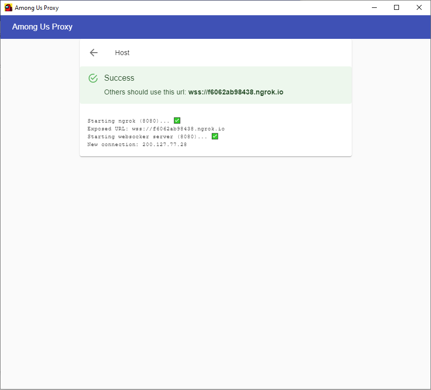
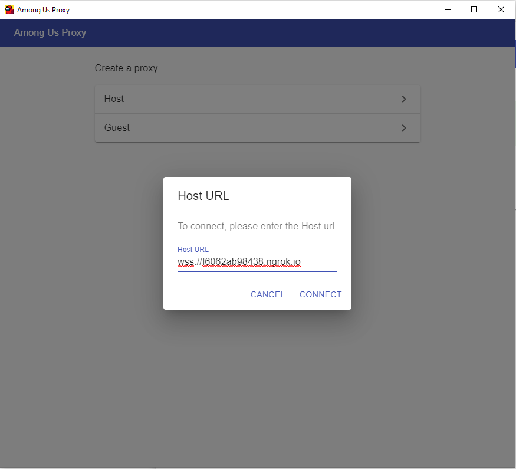

# Among Us Proxy

The idea of this is to create a proxy to play among us without the need of the multiplayer server. Among Us is a great game, but many times the multiplayer server are full which creates long queues while trying to play. This project tries to build a bridge, using Web Sockets, in order to use the local LAN protocol.

## How does this work?

When a local match is created, the among us local Host broadcast a discovery message to the port `47777`.

Guests are listening to this port on the local network. When a Guest connects to the Host, it sends udp packets to the port `22023` of the Host's ip.

Then, the Host uses the ip and port of the received message in order to communicate with each Guest. All the communication is done over udp.

This project aims to be fill the gap (using WebSockets) of this udp communication over internet.

On the Host side, it spins up a WebSocket server which Guests will connect to. When a Guest has connected, the Host opens an udp port which will be used to redirect all the WebSocket data to the local `22023` udp port (this is the port the Game Host is listening). Every message that is received on the opened udp port is forwarded to the Guest through the WebSocket.

On the Guest side, it connects through WebSocket to the Host server. In addition, it fakes the broadcast udp message discovery to make the game believe that there is a match on the local network. In order to fake an Among Us server, it listens to the local `22023` port. Everything that is read through this port is forwarded (through WebSocket) to the Host. Everything that is received from the WebSocket is forwarded to the game through the udp port.

This project contains a:
- [Command Line Interface](./packges/among-us-proxy)
- [Graphical User Interface](./packges/gui)

Both packages can be downloaded from the [releases section](./releases)

## How to use it?

_(This section will explain how to use the graphical user interface)_

First of all, we have to download the proxy application. This can be done on the [releases](https://github.com/NickCis/among-us-proxy/releases/) section. Download the latests _among-us-proxy-gui_ Setup.exe or zip file. Both packages contain this app. The _Setup.exe_ package offers an instalation menu while the zip one contains it on a compressed file.

When you open the proxy (if you've download the zip it'll be the file named `among-us-proxy-gui.exe`) you'll see the following window:


There are two types of users:
- Host: the person who will create the game on Among Us
- Guest: the people who will connect oto an available game

### Host

The Host should first click the _Host_ option under the proxy. After a few seconds, the following screen should appear:



You should take note of the url on the green screen (on the example `wss://401c05a16801.ngrok.io`) because it will be the url you will send to your friends. But, before doing that you should create the game on among us.

In order to create the game. First open Among Us. On the main screen:


Select the option _Local_. You'll see the following screen:


There you should click _Create Game_. By this point, the game should have started and you can now share the url with your friends!.

### Guest

The Guest should first click the _Guest_ option under the proxy. A popup will appear asking for the _hosts_ url:



On that input, the url that the host has generated has to be written. After pasting the url, you should click on _Connect_. You'll see the following screen:


Now you can connect to the game. First open Among Us. On the main screen:


Select the option _Local_. You'll see the following screen:


There you should see a _Proxy_ game on the _Available Games_ list. Double click in order to connect.

## Development

The project uses `npm` and [`lerna`](https://github.com/lerna/lerna).

Install dependencies:

```
$ npm run bootstrap
```

Code formatting:

```
$ npm run format
```

Packaging:

```
$ npm run lerna -- make
```
